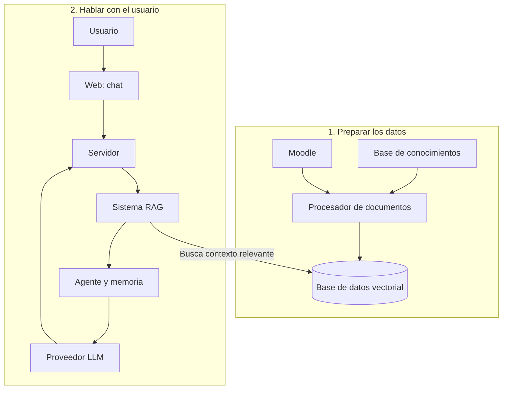

# Asistente-Virtual-Inteligente-para-Moodle
TRABAJO FINAL INTEGRADOR
# Asistente Virtual Inteligente para Moodle (Moodle RAG Agent)

**Propuesta de Proyecto Final** — Sistema web conversacional basado en Inteligencia Artificial con arquitectura RAG (Retrieval-Augmented Generation) e integración a la API de Moodle mediante *Function Calling*.

---

## 📋 Descripción del Proyecto

El **Asistente Virtual Inteligente para Moodle** es una plataforma web orientada a estudiantes universitarios que busca resolver la dispersión de información y simplificar el seguimiento académico dentro del campus virtual.

Mediante el uso de un **Agente RAG autónomo**, el sistema procesa lenguaje natural para consultar información en tiempo real desde la API REST de Moodle (entregas pendientes, fechas de exámenes, calificaciones, novedades de materias y recursos de estudio), permitiendo que el usuario interactúe con el campus como si estuviera conversando con un tutor académico personal.

---

## 🏗️ Arquitectura del Sistema



El proyecto está estructurado bajo un patrón de **Monorepo** dividido en tres módulos principales:

```text
moodle-rag-agent/
├── frontend/         # Interfaz de usuario (Chatbot interactivo + Dashboard)
├── backend/          # API Gateway, Autenticación y Persistencia
├── agent/            # Módulo de IA (Agente RAG + Integración con API Moodle)
└── docs/             # Documentación técnica y diagramas de arquitectura
```
## 🛠️ Tecnologías Utilizadas

| Capa | Tecnología | Descripción / Rol |
|---|---|---|
| **Frontend** | React / Vite, Tailwind CSS | Interfaz web responsiva, chat en tiempo real y formateo Markdown/LaTeX. |
| **Backend** | Spring Boot (Java) o Node.js / Express | API REST, orquestación de servicios, autenticación y persistencia de chat. |
| **IA / Agente** | Python, LangChain / DeepAgents / ADK | Módulo de IA, orquestador RAG y definición de *Tools* de la API de Moodle. |
| **Base de Datos** | PostgreSQL / MongoDB | Almacenamiento de usuarios, tokens de sesión e historial de conversaciones. |
| **Integración** | Moodle REST Web Services API | Fuente primaria de datos del campus virtual. |
| **Despliegue** | Docker, Render / Vercel / Railway | Contenedorización de servicios e infraestructura. |

### 🔄 Flujo de Datos

1. **Frontend:** El usuario envía una consulta en lenguaje natural a través de la interfaz de chat.
2. **Backend:** Valida la sesión del usuario, gestiona el historial de conversación y orquesta la comunicación con el módulo de IA.
3. **Agente RAG (IA):** Analiza la consulta y decide de forma autónoma qué herramienta (*Tool*) ejecutar (endpoints de Moodle como `core_enrol_get_users_courses`, `mod_assign_get_assignments`, etc.).
4. **API de Moodle:** Retorna los datos estructurados solicitados del campus virtual.
5. **Síntesis y Respuesta:** El Agente RAG procesa la información recibida, construye una respuesta contextualizada en lenguaje claro y la envía al usuario a través del Frontend.

 
👥 Integrantes del Equipo  
[Nahuel Urciuolli Zabala] — GitHub: [@NahuelZa](https://github.com/NahuelZa)  
[Luciano Joaquín Martínez] — GitHub: [@NahuelZa](https://github.com/lucianomartinez27)  
[Santiago Rodriguez] — GitHub: [@NahuelZa](https://github.com/Santi-R97)  
