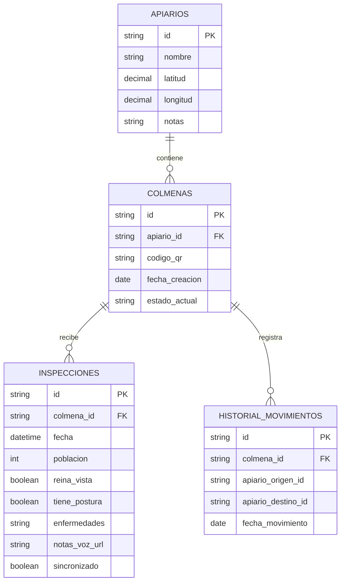

#  TRABAJO FINAL INTEGRADOR

# 🐝 BeeKeep: Sistema Inteligente de Gestión Apícola Offline

## 📝 Descripción del Proyecto

**BeeKeep** es (**VERIFICAR**) diseñada específicamente para apicultores que necesitan llevar un control estricto de sus apiarios y colmenas directamente en el campo. El proyecto nace para resolver un problema crítico en la industria: la falta de conectividad y la organizacion en las zonas rurales donde se encuentran los colmenares.

A diferencia de los cuadernos de papel que se mojan o se pierden, o de las apps tradicionales que requieren internet permanente, **BeeKeep** funciona bajo la filosofía *Offline-First*. Permite registrar de manera ágil el estado de los lotes, inspeccionar colmenas y guardar notas de voz, sincronizando toda la información de forma automática con la nube cuando el dispositivo recupera la señal.

---

## 🎯 Características Principales

*   **Gestión de Apiarios y Lotes**: Visualización clara del inventario de terrenos, coordenadas GPS y el conteo de colmenas activas calculado en tiempo real.
*   **Arquitectura Offline-First**: Registro de inspecciones y movimientos en el campo 100% sin internet utilizando bases de datos locales y UUIDs para evitar conflictos de sincronización.
*   **Identificación por Códigos QR**: Escaneo rápido de la colmena mediante la cámara del teléfono para abrir instantáneamente su historial médico y productivo.(**VERIFICAR**)
*   **Historial de movimientos**: Registro de movimientos para rastrear cuándo y por qué una colmena fue trasladada de un lote a otro.
*   **Inspecciones Manos Libres**: Interfaz optimizada con botones de gran tamaño e integración de dictado por voz (Speech-to-Text) para operar cómodamente usando guantes de protección.

---

## 🛠️ Stack Tecnológico

El proyecto está estructurado utilizando tecnologías modernas que garantizan portabilidad, velocidad y consistencia de datos:

*   **Frontend**: Flutter (Dart) / React Native (Cross-platform iOS y Android).(**VERIFICAR**)
*   **Base de Datos Local**: SQLite / Hive (Almacenamiento local optimizado).
*   **Backend & Sincronización**: Firebase / Supabase (Sincronización automática en la nube).

---

### 🔄 Flujo de Datos y Sincronización

```text
[ Interfaz de Usuario (App) ]
│
▼
┌──────────────────────────────┐
│    Capa de Repositorio       │
└────────────┬─────────────────┘
│¿Hay Internet?
├── NO ──> [ Base de Datos Local (SQLite/Hive) ] (Guarda el UUID de inmediato)│
└── SÍ ──> [ Base de Datos Local ] ──(Sincronización)──> [ Nube (Firebase/Supabase) ]
```

1. **Captura Local Inmediata**: Cualquier acción (crear un lote, registrar una inspección) se guarda primero en la base de datos interna del teléfono de forma instantánea.
2. **Uso de UUIDs**: Cada registro genera un código único universal en el teléfono. Esto evita que los datos choquen o se dupliquen cuando se suban a internet.
3. **Sincronización en Segundo Plano**: Un servicio oculto de la app detecta cuando el teléfono recupera la señal (Wi-Fi o datos móviles) y sube los cambios pendientes a la base de datos en la nube sin interrumpir al usuario.(**VERIFICAR**)

---

### 🗂️ Estructura de Capas (Código Limpio)

El código de la aplicación se divide en tres capas principales para separar las responsabilidades:

*   **Capas de Presentación (UI)**: Contiene las pantallas, botones gigantes, el lector de códigos QR y los controladores de la interfaz de usuario. No sabe cómo se guardan los datos, solo los muestra.
*   **Capa de Dominio (Lógica)**: Define las reglas del negocio de la apicultura (por ejemplo: "una colmena no puede estar en dos lotes a la vez" o "calcular la cantidad de colmenas por apiario").
*   **Capa de Datos (Data)**: Se encarga de la conexión con el exterior. Maneja la base de datos local (SQLite/Hive) y la lógica de sincronización con las APIs o servicios de la nube (Firebase/Supabase).

## 🔄 Flujo de Datos Detallado (Casos de Uso)
### Caso 1: Alta de un Nuevo Lote (Apiario) con GPS

Este flujo ocurre cuando el apicultor llega a un terreno nuevo y decide registrarlo como un punto de trabajo.
Para entender cómo se comporta la aplicación, a continuación se describen los tres flujos de datos más importantes del sistema, cubriendo el ciclo de vida de la información desde el campo hasta la nube.
```text
[Pantalla "Nuevo Lote"] ──(1. Clic Guardar)──> [Servicio GPS del Celular]
│
(2. Obtiene Coordenadas)
│
▼
[Nube (Firebase/Supabase)] <──(4. Segundo Plano)── [Base de Datos Local](Disponible en la Web)(ID: UUID generado)
```
1. **Entrada de datos**: El usuario escribe el nombre (ej. "Lote Las Acacias") y presiona el botón "Registrar Ubicación".
2. **Captura de Hardware**: La app solicita al chip GPS del teléfono las coordenadas de latitud y longitud exactas.
3. **Escritura Local (Instantánea)**: El sistema genera un `UUID` único y guarda el registro en la tabla `Apiarios` de la base de datos local. La interfaz se actualiza de inmediato mostrando el lote con `0` colmenas.
4. **Sincronización (Asíncrona)**: Si hay señal, el gestor de base de datos envía el registro a la nube. Si no, espera pacientemente en el teléfono.

---

### Caso 2: Inspección de Colmena mediante Código QR (Modo Offline)(**VERIFICAR**)

Este es el flujo más común. El apicultor está en el campo, sin internet, revisando una caja de abejas.
```text
[Cámara del Teléfono] ──(1. Escanea QR)──> [Busca ID localmente] ──> [Pantalla de la Colmena]
│
(2. Completa Formulario)
│
▼
[Cola de Sincronización] <──(4. Agrega a cola) <── [Tabla 'Inspecciones' Local]
```
1. **Lectura**: El apicultor apunta la cámara al sticker QR de la colmena. La app traduce el QR en un ID (ej: `colmena-104`) y abre su historial.
2. **Formulario Rápido**: El usuario marca con botones grandes que la reina está viva y que la población es alta. Si usa la voz, el teléfono traduce el audio a texto localmente.
3. **Persistencia**: Al presionar "Guardar", se inserta una fila en la tabla `Inspecciones` local, amarrada al ID de la colmena.
4. **Marcado de Pendiente**: El registro local se guarda con una bandera o estado de `sincronizado = false`.

---

### Caso 3: Recuperación de Conectividad y Sincronización de Datos(**VERIFICAR**)
Este flujo ocurre de forma invisible cuando el apicultor termina su jornada y regresa a su casa o a una zona con señal celular.
```text
[Red Móvil / Wi-Fi detectado]
│
▼
[Filtra registros donde 'sincronizado == false']│▼[Envía datos en bloques (Batch) a la Nube]
│
▼
[Nube responde OK] ───> [Cambia estado local a 'sincronizado == true']
```
1. **Escucha de Red**: Un "Listener" (oyente) del sistema operativo avisa a la app que el estado de la red cambió a "Conectado".
2. **Lectura de Pendientes**: La app interroga a la base de datos local: *"Dame todo lo que se haya creado hoy que tenga la bandera `sincronizado = false`"*.
3. **Envío Seguro**: Los datos se envían hacia Firebase/Supabase en paquetes pequeños para no saturar la conexión si la señal es débil.
4. **Confirmación**: Una vez que el servidor de la nube confirma que guardó los datos con éxito, la app cambia la bandera local a `sincronizado = true`. El teléfono queda limpio y listo para el día siguiente.
---
## 📊 Diagrama de Entidad-Relación (DER)

A continuación se muestra cómo se relacionan las tablas de la base de datos. Este diseño permite mantener el historial de cada colmena y sus revisiones, incluso si cambian de ubicación geográfica.



---

### 🔑 Explicación de las Relaciones

*   **APIARIOS a COLMENAS (Uno a Muchos - `||--o{`)**: Un lote o apiario puede tener muchas colmenas trabajando en él al mismo tiempo, pero una colmena en un momento específico solo puede pertenecer a un único apiario.
*   **COLMENAS a INSPECCIONES (Uno a Muchos - `||--o{`)**: Una colmena va a ser revisada muchas veces a lo largo de su vida. Cada revisión genera una nueva fila en la tabla de inspecciones conectada a esa colmena a través de su ID.
*   **COLMENAS a HISTORIAL\_MOVIMIENTOS (Uno a Muchos - `||--o{`)**: Sirve para auditar el camino de la colmena. Cada vez que una colmena viaja de un apiario a otro, se guarda el registro de dónde venía y a dónde fue, permitiendo reconstruir su ruta en el mapa.

 
👥 Integrantes del Equipo  
[Nahuel Urciuolli Zabala] — GitHub: [@NahuelZa](https://github.com/NahuelZa)  
[Luciano Joaquín Martínez] — GitHub: [@lucianomartinez27](https://github.com/lucianomartinez27)  
[Santiago Rodriguez] — GitHub: [@Santi-R9](https://github.com/Santi-R97)  
